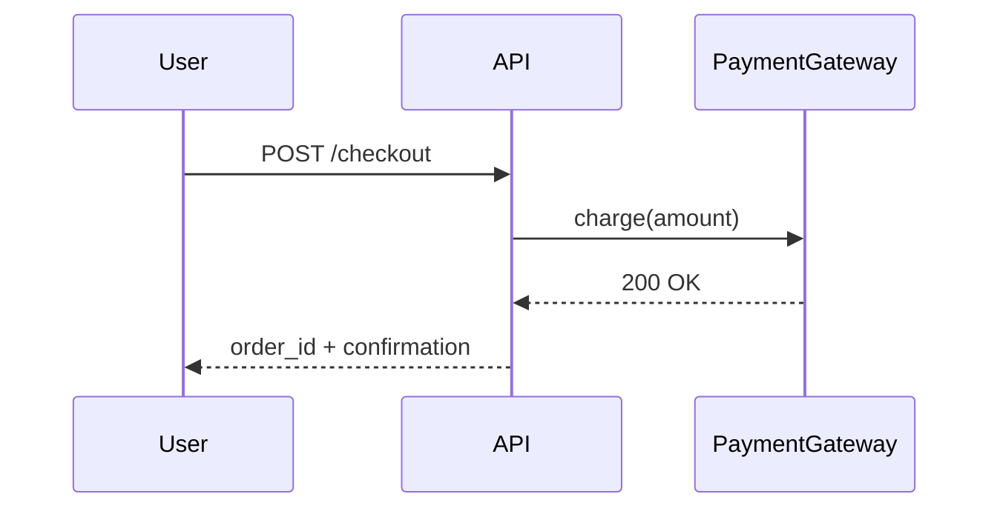
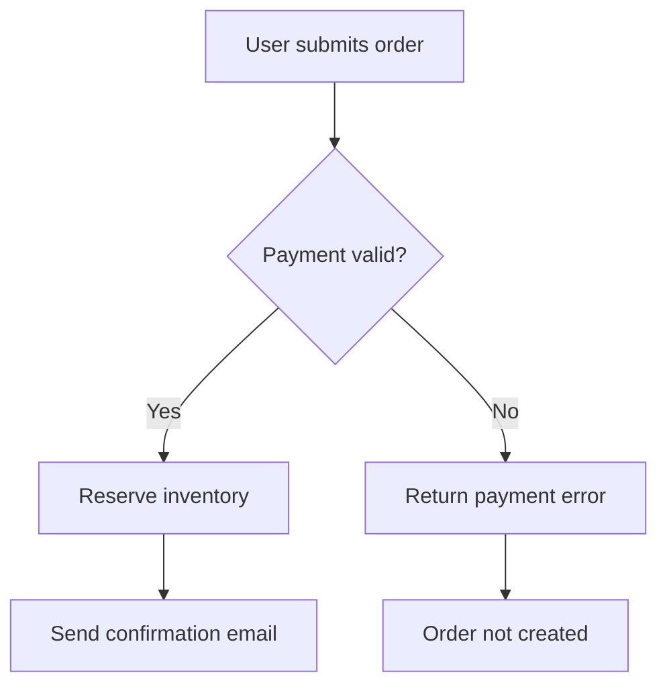

# Acceptance Criteria Implementation Plan

> **For agentic workers:** REQUIRED SUB-SKILL: Use superpowers:subagent-driven-development (recommended) or superpowers:executing-plans to implement this plan task-by-task. Steps use checkbox (`- [ ]`) syntax for tracking.

**Goal:** Add structured Acceptance Criteria (ACs) to Waypoint milestones —
captured at milestone definition, verified at milestone completion — by
modifying the milestone skeleton, brainstorming skill, all four slash
commands that touch milestone state, and the matching Situations of the
`waypoint:waypoint` skill.

**Architecture:** No new files in `plugins/waypoint/`. Every change is a
surgical edit to an existing skill prompt, command file, asset, or
manifest. Two pairs of files must stay in lockstep: (a) the CLAUDE.md
rules block emitted by `/waypoint:init` and by Situation 1 of
`waypoint:waypoint`; (b) the AC workflow described in
`/waypoint:phase` / `/waypoint:done` and mirrored in Situations 3, 4,
and 5 of `waypoint:waypoint`. Tasks that affect either pair are batched
to a single commit per pair.

**Tech Stack:** Markdown (SKILL.md, command files, skeleton, README) +
JSON (`plugin.json`). Verification via `grep`, `python3 -c 'import
json'`, and structural file reads.

**Branch:** `acceptance-criteria` (off `main`). The branch should be
created at execution time (via `superpowers:using-git-worktrees` or
plain `git switch -c`). The spec lives at
`docs/specs/2026-05-15-acceptance-criteria-design.md`.

**Reference spec:** Read it before starting — every task references it
by section.

---

## File map

**Modify:**
- `plugins/waypoint/skills/waypoint/assets/milestone_skeleton.md` —
  new `## Acceptance Criteria` section + `Done When` bullet (Task 1).
- `plugins/waypoint/skills/brainstorming/SKILL.md` — Step 3 / Step 4 /
  Step 5 / Step 6 updates, new "never do" bullet, Appendix
  (Tasks 2–7).
- `plugins/waypoint/commands/init.md` — append AC paragraph to the
  CLAUDE.md rules block (Task 8, with Task 8 partner).
- `plugins/waypoint/skills/waypoint/SKILL.md` — Situation 1 rules
  block (Task 8, with Task 8 partner); Situations 3 / 4 / 5 mirror
  the new command behaviour (Task 13).
- `plugins/waypoint/commands/milestone.md` — CLAUDE.md preamble
  (Task 9).
- `plugins/waypoint/commands/phase.md` — new step 5 + renumber existing
  5–7 to 6–8 (Task 10).
- `plugins/waypoint/commands/done.md` — phase step 4a (Task 11);
  milestone steps 5a–5e (Task 12).
- `plugins/waypoint/.claude-plugin/plugin.json` — version
  `0.2.0` → `0.3.0` (Task 14).
- `README.md` — Key concepts paragraph + Getting started AC mentions
  (Task 15).

**Untouched (intentionally):**
- `plugins/waypoint/skills/waypoint/assets/roadmap_skeleton.md` — already
  has the `**Stack:**` field used for stack detection.
- `plugins/waypoint/commands/archive.md` — archival is unaffected by ACs.
- `.claude-plugin/marketplace.json` — has no version field.

---

## Conventions

- **Commit messages:** short, imperative, no Conventional Commits prefix.
  Match the existing project style (e.g. `Bump plugin version to 0.2.0`,
  `Delegate Situation 2 (new milestone) to brainstorming skill`).
- **Verification "tests":** since this is a prompt-engineering change
  with no test runner, each task verifies by `grep` for presence of new
  strings, absence of removed strings, and structural reads of the file.
- **One commit per task** unless a task is explicitly marked
  "(lockstep — single commit)".
- **Spec section refs** use the H2/H3 headings of
  `docs/specs/2026-05-15-acceptance-criteria-design.md`.

---

## Task 1: Milestone skeleton — AC section + Done When bullet

**Spec ref:** "Milestone file format" → "New section — `## Acceptance Criteria`" and "`Done When` boilerplate addition".

**Files:**
- Modify: `plugins/waypoint/skills/waypoint/assets/milestone_skeleton.md`

- [ ] **Step 1: Read the current skeleton to locate the insertion points**

Run: `sed -n '20,45p' plugins/waypoint/skills/waypoint/assets/milestone_skeleton.md`
Expected: shows the existing `## Done When` block (ending with the
zero-stub-grep bullet) and the `---` separator above `## Phases`.

- [ ] **Step 2: Insert the new `## Acceptance Criteria` section between `Done When` and the `---` before `## Phases`**

Use Edit to replace this block:

```markdown
- Zero `STUB[ms-<slug>]` comments remain in the codebase
  (`grep -r "STUB\[ms-<slug>" src/` returns no results).

---

## Phases
```

with:

```markdown
- Zero `STUB[ms-<slug>]` comments remain in the codebase
  (`grep -r "STUB\[ms-<slug>" src/` returns no results).
- All Acceptance Criteria are ✅ passed (see the Acceptance Criteria section).

---

## Acceptance Criteria

> Business-level success criteria for this milestone. Each criterion is
> verified automatically where possible; `uat` criteria require human
> sign-off. A milestone cannot be marked complete while any criterion is
> ⬜ untested or ❌ failed (see CLAUDE.md rules).

_(none yet — populated during milestone definition)_

---

## Phases
```

- [ ] **Step 3: Verify the new section appears between Done When and Phases**

Run: `grep -nE '^## (Done When|Acceptance Criteria|Phases)' plugins/waypoint/skills/waypoint/assets/milestone_skeleton.md`
Expected (line numbers will differ; order must be):
```
NN:## Done When
NN:## Acceptance Criteria
NN:## Phases
```

- [ ] **Step 4: Verify the new Done When bullet is present**

Run: `grep -F 'All Acceptance Criteria are ✅ passed' plugins/waypoint/skills/waypoint/assets/milestone_skeleton.md`
Expected: one match.

- [ ] **Step 5: Commit**

```bash
git add plugins/waypoint/skills/waypoint/assets/milestone_skeleton.md
git commit -m "Add Acceptance Criteria section to milestone skeleton"
```

---

## Task 2: Brainstorming skill — Step 3 replace Success signal bullet

**Spec ref:** "Brainstorming skill changes" → "Step 3 — replace Success signal topic".

**Files:**
- Modify: `plugins/waypoint/skills/brainstorming/SKILL.md`

- [ ] **Step 1: Locate the Success signal bullet**

Run: `grep -n 'Success signal' plugins/waypoint/skills/brainstorming/SKILL.md`
Expected: one line match around line 138 (inside Step 3's bullet list).

- [ ] **Step 2: Replace the Success signal bullet with the AC bullet**

Use Edit to replace this block (verbatim from the current SKILL.md):

```markdown
- **Success signal.** How would you know this milestone is done if
  you came back after a month away? Push for something observable
  and verifiable.
```

with:

```markdown
- **Acceptance criteria.** What does success look like when this
  milestone is done? Describe the behaviors, invariants, or workflows
  that must hold — in business or capability terms, not in test-tool
  terms. Push for things that are observable and verifiable. This
  conversation produces the milestone's structured Acceptance
  Criteria (translated in Step 5).
```

- [ ] **Step 3: Verify the Success signal bullet is gone and the AC bullet is present**

Run: `grep -c 'Success signal' plugins/waypoint/skills/brainstorming/SKILL.md`
Expected: `0`

Run: `grep -cF 'Acceptance criteria.' plugins/waypoint/skills/brainstorming/SKILL.md`
Expected: at least `1`

- [ ] **Step 4: Commit**

```bash
git add plugins/waypoint/skills/brainstorming/SKILL.md
git commit -m "Replace Success signal topic with Acceptance Criteria discussion in Step 3"
```

---

## Task 3: Brainstorming skill — "What this skill must never do" new bullet

**Spec ref:** "Brainstorming skill changes" → "'What this skill must never do' — new bullet".

**Files:**
- Modify: `plugins/waypoint/skills/brainstorming/SKILL.md`

- [ ] **Step 1: Locate the end of the "never do" list**

Run: `grep -n 'belong to phase planning and completion' plugins/waypoint/skills/brainstorming/SKILL.md`
Expected: one line match (the final bullet of the "never do" section).

- [ ] **Step 2: Append the new bullet after that line**

Use Edit to replace this block:

```markdown
- Add entries to **Architecture References** or **Decisions Log** — those
  belong to phase planning and completion, not milestone definition.

## Conversation rules
```

with:

```markdown
- Add entries to **Architecture References** or **Decisions Log** — those
  belong to phase planning and completion, not milestone definition.
- Discuss verify commands, test tools, or framework choices during
  AC capture. That belongs to phase planning. ACs at
  milestone-definition time are tech-agnostic capability statements
  with `verify: TODO`.

## Conversation rules
```

- [ ] **Step 3: Verify the new bullet is in the "never do" list (between "Decisions Log" bullet and "## Conversation rules")**

Run: `awk '/## What this skill must never do/,/## Conversation rules/' plugins/waypoint/skills/brainstorming/SKILL.md | grep -c 'verify commands, test tools'`
Expected: `1`

- [ ] **Step 4: Commit**

```bash
git add plugins/waypoint/skills/brainstorming/SKILL.md
git commit -m "Forbid tech-tool discussion during AC capture in brainstorming skill"
```

---

## Task 4: Brainstorming skill — Step 4 add final-verification-phase guidance

**Spec ref:** "Brainstorming skill changes" → "Step 4 — optional final verification phase".

**Files:**
- Modify: `plugins/waypoint/skills/brainstorming/SKILL.md`

- [ ] **Step 1: Locate the end of Step 4**

Run: `grep -n 'Focus.*Key Deliverable.*Handoff' plugins/waypoint/skills/brainstorming/SKILL.md`
Expected: one or more matches; locate the line at the very end of Step
4 that reads `Deliverable**, and **Handoff** (what the next phase can rely on).`

- [ ] **Step 2: Append the final-verification-phase guidance**

Use Edit to replace this block (verbatim end of Step 4):

```markdown
Ask the user to pick an option or propose a variant. Then refine the
chosen decomposition: for each phase, confirm **Focus**, **Key
Deliverable**, and **Handoff** (what the next phase can rely on).

## Step 5 — Incremental validation
```

with:

```markdown
Ask the user to pick an option or propose a variant. Then refine the
chosen decomposition: for each phase, confirm **Focus**, **Key
Deliverable**, and **Handoff** (what the next phase can rely on).

**Final verification phase (optional).** When ACs are numerous,
mutually dependent, or live in a regulated/safety-critical domain,
you MAY include a final verification phase in one or more of the
decomposition options. This is not mandatory and most milestones will
not need one — but it is a legitimate decomposition choice when
verification work is large enough to deserve its own coherent step.

## Step 5 — Incremental validation
```

- [ ] **Step 3: Verify the new paragraph is between Step 4 and Step 5**

Run: `awk '/## Step 4 /,/## Step 5 /' plugins/waypoint/skills/brainstorming/SKILL.md | grep -c 'Final verification phase'`
Expected: `1`

- [ ] **Step 4: Commit**

```bash
git add plugins/waypoint/skills/brainstorming/SKILL.md
git commit -m "Allow final verification phase as decomposition option in Step 4"
```

---

## Task 5: Brainstorming skill — Step 5 add AC as fifth validated section

**Spec ref:** "Brainstorming skill changes" → "Step 5 — add Acceptance Criteria as the fifth validated section".

**Files:**
- Modify: `plugins/waypoint/skills/brainstorming/SKILL.md`

- [ ] **Step 1: Locate the current Step 5 numbered list (four items)**

Run: `awk '/## Step 5/,/## Step 6/' plugins/waypoint/skills/brainstorming/SKILL.md | head -30`
Expected: shows the four items (`1. **Goal**`, `2. **Scope**`, `3. **Done When**`, `4. **Phases table**`) and the "Ready to write the milestone file?" line.

- [ ] **Step 2: Replace the four-item list and confirmation line with a five-item list**

Use Edit to replace this block:

```markdown
Present in this order, one at a time:

1. **Goal** — one crisp paragraph.
2. **Scope** (bulleted deliverables) + **Out of Scope** (bulleted
   exclusions).
3. **Done When** — verifiable criteria. Always includes both: *all
   phases complete* AND *zero `STUB[ms-<slug>]` comments remain
   (`grep -r "STUB\[ms-<slug>" src/` returns no results)*.
4. **Phases table** — all phases with **Focus**, **Key Deliverable**,
   **Handoff**.

After all four sections are approved, confirm once:

> *"Ready to write the milestone file?"*
```

with:

```markdown
Present in this order, one at a time:

1. **Goal** — one crisp paragraph.
2. **Scope** (bulleted deliverables) + **Out of Scope** (bulleted
   exclusions).
3. **Done When** — verifiable criteria. Always includes all three:
   *all phases complete*, *zero `STUB[ms-<slug>]` comments remain
   (`grep -r "STUB\[ms-<slug>" src/` returns no results)*, and *all
   Acceptance Criteria ✅ passed*.
4. **Phases table** — all phases with **Focus**, **Key Deliverable**,
   **Handoff**.
5. **Acceptance Criteria** — propose 2–4 (occasionally more) criteria
   covering what was discussed in Step 3. For each, pick the format
   that best fits its nature (gherkin, user-story, decision-table,
   ears, sequence, bpmn) and the type (capability, invariant,
   integration, performance, uat). See the Appendix for format and
   type reference. Set `verify: TODO` and `status: ⬜ untested` for
   non-`uat` ACs; for `uat`, set `verify: manual`. The user may push
   back on format, type, or wording; iterate until approved.

After all five sections are approved, confirm once:

> *"Ready to write the milestone file?"*
```

- [ ] **Step 3: Verify Step 5 now has a fifth item and references the Appendix**

Run: `awk '/## Step 5 /,/## Step 6 /' plugins/waypoint/skills/brainstorming/SKILL.md | grep -cE '^[1-5]\. \*\*'`
Expected: `5`

Run: `awk '/## Step 5 /,/## Step 6 /' plugins/waypoint/skills/brainstorming/SKILL.md | grep -c 'See the Appendix'`
Expected: `1`

- [ ] **Step 4: Commit**

```bash
git add plugins/waypoint/skills/brainstorming/SKILL.md
git commit -m "Add Acceptance Criteria as fifth validated section in Step 5"
```

---

## Task 6: Brainstorming skill — Step 6 write AC blocks into the milestone file

**Spec ref:** "Brainstorming skill changes" → "Step 6 — write AC blocks into the milestone file".

**Files:**
- Modify: `plugins/waypoint/skills/brainstorming/SKILL.md`

- [ ] **Step 1: Locate the Step 6 bullet list of milestone sections to populate**

Run: `awk '/## Step 6/,/^Append a row/' plugins/waypoint/skills/brainstorming/SKILL.md`
Expected: shows the existing bullet list (Header, Goal/Scope/Done When,
Phases table, Architecture References, Decisions Log, Deferred Wiring,
How to Continue).

- [ ] **Step 2: Insert an Acceptance Criteria bullet between "Phases table" and "Architecture References"**

Use Edit to replace this block:

```markdown
- **Phases table.** All phases with **Focus**, **Key Deliverable**,
  **Handoff** filled in; **Design Doc** = `TBD`, **Plan** = `TBD`,
  **Status** = `Not started`.
- **Architecture References** — leave the placeholder row
```

with:

```markdown
- **Phases table.** All phases with **Focus**, **Key Deliverable**,
  **Handoff** filled in; **Design Doc** = `TBD`, **Plan** = `TBD`,
  **Status** = `Not started`.
- **Acceptance Criteria.** Replace the `_(none yet — populated during
  milestone definition)_` placeholder with the approved AC blocks
  from Step 5, numbered AC-1, AC-2, …. Each block has `format:`,
  `type:`, body, `verify: TODO` (or `verify: manual` for `uat`), and
  `status: ⬜ untested`. AC numbers are stable — never renumber after
  assignment.
- **Architecture References** — leave the placeholder row
```

- [ ] **Step 3: Verify the new bullet is present in Step 6**

Run: `awk '/## Step 6/,/^---$/' plugins/waypoint/skills/brainstorming/SKILL.md | grep -cF '**Acceptance Criteria.**'`
Expected: `1`

- [ ] **Step 4: Commit**

```bash
git add plugins/waypoint/skills/brainstorming/SKILL.md
git commit -m "Have Step 6 write AC blocks into the milestone file"
```

---

## Task 7: Brainstorming skill — append Appendix with formats and types

**Spec ref:** "Brainstorming skill changes" → "Appendix — AC formats and types reference".

**Files:**
- Modify: `plugins/waypoint/skills/brainstorming/SKILL.md`

- [ ] **Step 1: Locate the end of the file**

Run: `tail -5 plugins/waypoint/skills/brainstorming/SKILL.md`
Expected: the closing line of Step 6 (containing the follow-up pointer
about `/waypoint:phase <slug> 1`).

- [ ] **Step 2: Append the Appendix**

Use Edit to replace this block (the last quoted block of Step 6):

```markdown
> *"Milestone `ms-<slug>` written to
> `docs/milestones/ms-<slug>.md` and added to the roadmap. When
> ready, run `/waypoint:phase <slug> 1` to start planning phase 1."*
```

with:

```markdown
> *"Milestone `ms-<slug>` written to
> `docs/milestones/ms-<slug>.md` and added to the roadmap. When
> ready, run `/waypoint:phase <slug> 1` to start planning phase 1."*

---

## Appendix — Acceptance Criteria formats and types

Reference material consulted in Step 5 when proposing AC blocks.
Format is per-criterion, not per-milestone — multiple formats may
appear in the same milestone. Pick the format that best fits each
criterion's nature.

### Formats

**Gherkin (Given/When/Then).** Use when: BDD, automating acceptance
tests, shared understanding between technical and non-technical
stakeholders.

````markdown
```gherkin
Feature: User checkout

  Scenario: Successful checkout with valid payment
    Given a user has items in their cart
    And their payment method is valid
    When they confirm the order
    Then the order is created with status "confirmed"
    And they receive a confirmation email
```
````

**User Story + Bullet Criteria.** Use when: lightweight agile teams,
criteria don't require formal test automation.

```markdown
As a shopper, I want to complete checkout in under 3 steps,
so that I can purchase without friction.

- [ ] Cart → Address → Payment → Confirmation flow works end-to-end
- [ ] Back navigation preserves entered data
- [ ] Guest checkout does not require account creation
```

**Decision Table.** Use when: logic has many combinations of inputs
and expected outputs (pricing rules, permission matrices, discount
tiers).

```markdown
| User Role | Subscription | Feature X | Expected Access |
|-----------|-------------|-----------|-----------------|
| admin     | any         | enabled   | ✅ allowed       |
| user      | pro         | enabled   | ✅ allowed       |
| user      | free        | enabled   | ❌ denied        |
| user      | any         | disabled  | ❌ denied        |
```

**EARS (Easy Approach to Requirements Syntax).** Use when: regulated
or safety-critical domains where requirements must be unambiguous and
traceable.

```markdown
- WHEN a payment fails THEN the system SHALL NOT decrement inventory.
- WHILE a checkout session is active THE system SHALL hold reserved stock.
- WHERE tax jurisdiction is EU THE system SHALL apply VAT before displaying price.
```

**Sequence Diagram (Mermaid).** Use when: criteria involve complex
multi-system interactions or need to communicate integration contracts.

````markdown

````

**BPMN (Mermaid flowchart).** Use when: criteria describe a business
process involving multiple actors or systems with branching logic.

````markdown

````

### Types

| Type | What it asserts | Verify mechanism |
|---|---|---|
| `capability` | A user-facing behavior works end-to-end | Integration / e2e test |
| `invariant` | A data or state property always holds | Property test or DB assertion |
| `integration` | An external system connects and responds correctly | Probe script or contract test |
| `performance` | A measurable threshold is met (latency, throughput, etc.) | Benchmark command |
| `uat` | A workflow requires human sign-off | `verify: manual` — user sets status explicitly |
```

- [ ] **Step 3: Verify the Appendix is the last section**

Run: `grep -nE '^## (Appendix|Step)' plugins/waypoint/skills/brainstorming/SKILL.md | tail -3`
Expected: last line begins with `## Appendix — Acceptance Criteria formats and types`.

- [ ] **Step 4: Verify all six formats and five types are present**

Run: `for fmt in 'Gherkin' 'User Story' 'Decision Table' 'EARS' 'Sequence Diagram' 'BPMN'; do grep -F "**$fmt" plugins/waypoint/skills/brainstorming/SKILL.md | wc -l; done`
Expected: each line outputs `1`.

Run: `for t in 'capability' 'invariant' 'integration' 'performance' 'uat'; do grep -E "\`$t\`" plugins/waypoint/skills/brainstorming/SKILL.md | wc -l; done`
Expected: each line outputs at least `1`.

- [ ] **Step 5: Commit**

```bash
git add plugins/waypoint/skills/brainstorming/SKILL.md
git commit -m "Append AC formats and types reference Appendix to brainstorming skill"
```

---

## Task 8: CLAUDE.md rules block — init.md + waypoint SKILL.md Situation 1 (lockstep — single commit)

**Spec ref:** "CLAUDE.md rules block — new paragraph".

**Files:**
- Modify: `plugins/waypoint/commands/init.md`
- Modify: `plugins/waypoint/skills/waypoint/SKILL.md`

The same paragraph must be appended to two places. Apply both edits,
then verify the appended text is byte-identical between the two heredocs.

- [ ] **Step 1: Locate the end of init.md's rules block heredoc**

Run: `grep -n 'Run the grep to verify zero results before closing' plugins/waypoint/commands/init.md`
Expected: one line match (the last paragraph of the existing rules block).

- [ ] **Step 2: Append the AC paragraph to init.md**

Use Edit to replace this block:

```markdown
### Completing a milestone
A milestone CANNOT be marked complete while any STUB[ms-<slug>] comment exists.
Run the grep to verify zero results before closing.
---
```

with:

```markdown
### Completing a milestone
A milestone CANNOT be marked complete while any STUB[ms-<slug>] comment exists.
Run the grep to verify zero results before closing.

### Acceptance Criteria

A milestone cannot be marked complete while any AC has:
- status: ⬜ untested  (run /waypoint:done to trigger verification)
- status: ❌ failed    (fix the failure, or change type to `uat` and document why)
- verify: TODO         (assign and generate verification during the phase that delivers the AC)

UAT-type criteria (verify: manual) must have status set to ✅ passed
explicitly by the user before /waypoint:done will proceed.

Editing an AC's body, format, type, or verify command after it has
passed resets its status to ⬜ untested. Trivial title edits do not.

Do not invent or skip ACs to unblock completion. If a criterion cannot
be tested automatically, change its type to `uat` and document why.
---
```

- [ ] **Step 3: Locate the end of Situation 1's rules block in waypoint SKILL.md**

Run: `grep -n 'Ensure the architecture doc is listed' plugins/waypoint/skills/waypoint/SKILL.md`
Expected: one line match.

- [ ] **Step 4: Append the AC paragraph to waypoint SKILL.md Situation 1**

Use Edit to replace this block:

```markdown
3. Ensure the architecture doc is listed in the milestone's **Architecture
   References** section.
```
```

with:

```markdown
3. Ensure the architecture doc is listed in the milestone's **Architecture
   References** section.

### Acceptance Criteria

A milestone cannot be marked complete while any AC has:
- status: ⬜ untested  (run /waypoint:done to trigger verification)
- status: ❌ failed    (fix the failure, or change type to `uat` and document why)
- verify: TODO         (assign and generate verification during the phase that delivers the AC)

UAT-type criteria (verify: manual) must have status set to ✅ passed
explicitly by the user before /waypoint:done will proceed.

Editing an AC's body, format, type, or verify command after it has
passed resets its status to ⬜ untested. Trivial title edits do not.

Do not invent or skip ACs to unblock completion. If a criterion cannot
be tested automatically, change its type to `uat` and document why.
```
```

- [ ] **Step 5: Diff-check that both AC paragraphs are byte-identical**

Use `grep -A 16` to capture the heading and the following 16 lines of
body from each file, then diff:

```bash
grep -A 16 '^### Acceptance Criteria' plugins/waypoint/commands/init.md > /tmp/init_ac.txt
grep -A 16 '^### Acceptance Criteria' plugins/waypoint/skills/waypoint/SKILL.md > /tmp/skill_ac.txt
diff /tmp/init_ac.txt /tmp/skill_ac.txt
```

Expected: no output (the two captures are byte-identical). If there is
any output, the two paragraphs have drifted; fix the divergent file
before continuing.

- [ ] **Step 6: Commit both files in one go**

```bash
git add plugins/waypoint/commands/init.md plugins/waypoint/skills/waypoint/SKILL.md
git commit -m "Add Acceptance Criteria paragraph to CLAUDE.md rules block (init + Situation 1)"
```

---

## Task 9: `/waypoint:milestone` preamble — CLAUDE.md self-healing check

**Spec ref:** "`/waypoint:milestone` preamble".

**Files:**
- Modify: `plugins/waypoint/commands/milestone.md`

- [ ] **Step 1: Read the current command**

Run: `cat plugins/waypoint/commands/milestone.md`
Expected: 9 lines — the thin delegation to `waypoint:brainstorming`.

- [ ] **Step 2: Replace the body with the preamble + delegation**

Use Edit to replace the entire current file body:

```markdown
Create a new milestone. $ARGUMENTS may contain a slug.

Invoke the `waypoint:brainstorming` skill, passing $ARGUMENTS through.
The skill owns the full milestone-definition flow: context research,
scope assessment, capability and scope discussion, phase decomposition,
incremental validation, and writing `docs/milestones/ms-<slug>.md`
plus the row in `docs/roadmap.md`. Do not duplicate any of those
steps here.
```

with:

```markdown
Create a new milestone. $ARGUMENTS may contain a slug.

1. Check `CLAUDE.md` for the heading `### Acceptance Criteria` inside
   the `## Roadmap & Stub Rules` section. If the heading is missing
   (typical for projects initialized before plugin v0.3.0), append the
   exact paragraph below to the rules block. If the heading is already
   present, do nothing — this step is idempotent. Skip silently if
   `CLAUDE.md` does not exist.

   Paragraph to append:

       ### Acceptance Criteria

       A milestone cannot be marked complete while any AC has:
       - status: ⬜ untested  (run /waypoint:done to trigger verification)
       - status: ❌ failed    (fix the failure, or change type to `uat` and document why)
       - verify: TODO         (assign and generate verification during the phase that delivers the AC)

       UAT-type criteria (verify: manual) must have status set to ✅ passed
       explicitly by the user before /waypoint:done will proceed.

       Editing an AC's body, format, type, or verify command after it has
       passed resets its status to ⬜ untested. Trivial title edits do not.

       Do not invent or skip ACs to unblock completion. If a criterion cannot
       be tested automatically, change its type to `uat` and document why.

2. Invoke the `waypoint:brainstorming` skill, passing $ARGUMENTS
   through. The skill owns the full milestone-definition flow: context
   research, scope assessment, capability and scope discussion, phase
   decomposition, incremental validation (including Acceptance
   Criteria), and writing `docs/milestones/ms-<slug>.md` plus the row
   in `docs/roadmap.md`. Do not duplicate any of those steps here.
```

- [ ] **Step 3: Verify the new step 1 is present and step 2 still delegates**

Run: `grep -c '### Acceptance Criteria' plugins/waypoint/commands/milestone.md`
Expected: `1`

Run: `grep -c 'waypoint:brainstorming' plugins/waypoint/commands/milestone.md`
Expected: `1`

- [ ] **Step 4: Commit**

```bash
git add plugins/waypoint/commands/milestone.md
git commit -m "Add CLAUDE.md AC-rules self-healing preamble to /waypoint:milestone"
```

---

## Task 10: `/waypoint:phase` — insert new step 5 + renumber existing 5–7

**Spec ref:** "`/waypoint:phase` changes".

**Files:**
- Modify: `plugins/waypoint/commands/phase.md`

The existing file has seven numbered steps. We insert a new step 5
(AC review) between current step 4 (stub grep) and current step 5
(brainstorm and propose plan). The existing steps 5–7 renumber to 6–8.

- [ ] **Step 1: Read the current file**

Run: `cat plugins/waypoint/commands/phase.md`
Expected: 31 lines, steps numbered 1–7.

- [ ] **Step 2: Replace the entire file body**

Use Edit to replace the entire current file body with:

```markdown
Start planning a phase. $ARGUMENTS format: [ms-slug] [phase-number]
Both are optional if the milestone and phase are unambiguous from context.

1. Read docs/roadmap.md and the relevant milestone file. Identify the milestone
   slug and phase number from $ARGUMENTS or context. If still ambiguous, ask.
2. Verify all prior phases are ✅ Complete. If any prior phase is not complete,
   stop and report which phase is blocking — do not proceed.
3. If this is not phase 1, review the previous phase's Handoff note to
   understand what this phase builds on.
4. Run the stub grep:

       grep -r "STUB\[ms-<slug>" src/

   Report all results. Each hit is a mandatory task prepended to the plan:
   locate stub → implement real logic → wire → delete comment.
5. Acceptance Criteria review:
   a. Read the milestone file's `## Acceptance Criteria` section.
   b. Print a one-line summary: `ACs: N total — X ✅ / Y ⬜ / Z ❌ / W manual`.
   c. Ask: *"Based on what you've learned so far, any AC changes needed
      before planning this phase? (add / edit / remove / none)"* Apply
      edits to the milestone file. New ACs get the next free AC-N,
      `verify: TODO`, `status: ⬜ untested`. Material edits (body,
      format, type, verify command) to a previously ✅ passed AC reset
      its status to ⬜ untested.
   d. For each AC with `verify: TODO`, ask: *"Will this phase fully
      deliver AC-N: <title>?"* If yes, add an explicit
      verify-generation task to the phase plan (see step 6). If no,
      leave the AC as `verify: TODO` for a later phase.
   e. `uat` ACs (`verify: manual`) are never assigned
      verify-generation tasks.

   Stack detection for verify generation: read `docs/roadmap.md`'s
   `**Stack:**` field first; if absent or vague, use what the user has
   stated in conversation; if still unclear, ask the user with a concrete
   recommendation based on visible source files.

   Verify-strategy mapping by AC type:
   - `capability` / gherkin: BDD runner if present (cucumber, behave,
     pytest-bdd) → otherwise e2e (playwright, cypress, httpx).
   - `capability` / other formats: integration test in the project's
     primary test runner.
   - `invariant`: property test (hypothesis, fast-check, quickcheck) →
     otherwise parameterized unit test.
   - `integration`: contract test if framework exists (pact) →
     otherwise probe script against real/mock service.
   - `performance`: existing bench harness (k6, locust, wrk) →
     otherwise `time` + threshold assertion in shell.
   - `uat`: always `manual` — no inference.

   Test placement: if `tests/` or `spec/` exists, read it to infer
   conventions before generating. If no AC-style tests exist yet, ask
   the user whether to add to the existing tree or create `tests/ac/`
   (recommend `tests/ac/`). If no test infrastructure exists at all,
   generate a self-contained script at
   `tests/ac/ms-<slug>/verify_ac_<n>.sh`.

6. Brainstorm and propose a plan. Order tasks: stub resolution first,
   then verify-script generation for any ACs assigned to this phase
   (each task labelled "Generate verify script for AC-N (<title>) —
   <chosen approach>"), then the rest of the plan. Get user
   confirmation before finalizing.
7. After the plan is agreed, check for architectural decisions:
   Were any decisions made during planning that have lasting impact (e.g.
   library choice, data model, API contract, infrastructure pattern)?
   For each yes:
   - Create or update docs/architecture/<topic>.md.
     New doc: sections — Context, Decision, Rationale, Consequences.
     Existing doc: append a dated entry to its Change Log section.
   - Add the doc to the milestone's Architecture References (if not listed).
   - Add a row to the milestone's Decisions Log:
     Date | Decision | Impact | Architecture Doc Updated.
8. Update the phase row in the milestone's Phases table:
   - Set Design Doc and Plan to filenames/links (or TBD if not yet written).
   - Set Status to 🔄 In progress.
```

- [ ] **Step 3: Verify there are now 8 top-level numbered steps**

Run: `grep -cE '^[0-9]+\. ' plugins/waypoint/commands/phase.md`
Expected: `8`

- [ ] **Step 4: Verify step 5 is the AC review step**

Run: `grep -nE '^5\. ' plugins/waypoint/commands/phase.md`
Expected: line matches `5. Acceptance Criteria review:`.

- [ ] **Step 5: Verify the verify-strategy mapping is present**

Run: `grep -c 'pytest-bdd\|playwright\|hypothesis\|locust' plugins/waypoint/commands/phase.md`
Expected: at least `3` (matches across multiple lines).

- [ ] **Step 6: Commit**

```bash
git add plugins/waypoint/commands/phase.md
git commit -m "Add AC review step to /waypoint:phase (insert step 5, renumber 5-7 to 6-8)"
```

---

## Task 11: `/waypoint:done` — phase completion step 4a

**Spec ref:** "`/waypoint:done` changes" → "Phase completion flow — step 4a".

**Files:**
- Modify: `plugins/waypoint/commands/done.md`

- [ ] **Step 1: Locate the current phase-completion step 4**

Run: `grep -nE '^4\. Update the phase row' plugins/waypoint/commands/done.md`
Expected: one line match.

- [ ] **Step 2: Insert step 4a after the existing step 4 block**

Use Edit to replace this block:

```markdown
4. Update the phase row in the Phases table:
   - Set Design Doc and Plan links if still TBD.
   - Set Status to ✅ Complete.

---

## Milestone completion (last phase only)
```

with:

```markdown
4. Update the phase row in the Phases table:
   - Set Design Doc and Plan links if still TBD.
   - Set Status to ✅ Complete.
4a. AC verify-script presence check. For any AC whose
    verify-generation was assigned to this phase, confirm the
    script/test file exists and the milestone file's `verify:` field
    is no longer `TODO`. If a verify is still `TODO`, flag the user
    and ask whether the AC was actually delivered. Do not run the
    verify command at phase completion — verification runs only at
    milestone completion.

---

## Milestone completion (last phase only)
```

- [ ] **Step 3: Verify step 4a is present**

Run: `grep -c '^4a\. AC verify-script presence' plugins/waypoint/commands/done.md`
Expected: `1`

- [ ] **Step 4: Commit**

```bash
git add plugins/waypoint/commands/done.md
git commit -m "Add AC verify-script presence check to /waypoint:done phase flow"
```

---

## Task 12: `/waypoint:done` — milestone completion steps 5a–5e

**Spec ref:** "`/waypoint:done` changes" → "Milestone completion flow — steps 5a–5e".

**Files:**
- Modify: `plugins/waypoint/commands/done.md`

- [ ] **Step 1: Locate the current milestone-completion step 5 (stub grep)**

Run: `awk '/^## Milestone completion/,/^7\./' plugins/waypoint/commands/done.md`
Expected: shows steps 5, 6, 7.

- [ ] **Step 2: Insert steps 5a–5e after the existing step 5 (stub grep) and before step 6 (status flip)**

Use Edit to replace this block:

```markdown
5. Run the full stub grep:

       grep -r "STUB\[ms-<slug>" src/

   If any results are found: STOP. The milestone cannot be closed.
   Report the remaining stubs and ask the user how to handle them.
6. If zero results:
```

with:

```markdown
5. Run the full stub grep:

       grep -r "STUB\[ms-<slug>" src/

   If any results are found: STOP. The milestone cannot be closed.
   Report the remaining stubs and ask the user how to handle them.
5a. Pre-flight AC check. Print the AC summary line: `ACs: N total —
    X ✅ / Y ⬜ / Z ❌ / W manual`. Scan for any AC with `verify: TODO`.
    If found, STOP — list them and prompt the user that verify scripts
    must be generated (likely via a missed `/waypoint:phase` step)
    before the milestone can close. Do not flip status.
5b. Run verifies. For each AC with `verify:` set to a real shell
    command (i.e., not `TODO`, not `manual`): run the command
    sequentially, capture its exit code, and update the milestone
    file's `status:` field — `✅ passed` on exit 0, `❌ failed` on any
    other exit.
5c. Handle failures. If any AC ended `❌ failed`: STOP. Print the
    failure output for each, print the updated AC summary line, and
    prompt the user to either fix the implementation or — if the
    criterion genuinely cannot be tested automatically — change the
    AC's type to `uat` and document why. Do not flip status. Do not
    auto-retry; the user re-invokes `/waypoint:done` after fixing.
5d. Manual / UAT check. For each AC with `verify: manual`: confirm
    the user has set `status: ✅ passed`. If any is still
    `⬜ untested`, STOP and list them, prompting the user to perform
    the UAT and update status. Do not flip status.
5e. All passed. Only when every AC is `✅ passed` proceed to step 6.
6. If zero results:
```

- [ ] **Step 3: Verify all five new steps are present in order**

Run: `grep -nE '^5[abcde]\. ' plugins/waypoint/commands/done.md`
Expected: five lines in order — `5a.`, `5b.`, `5c.`, `5d.`, `5e.` —
each on its own line, all under "## Milestone completion".

- [ ] **Step 4: Commit**

```bash
git add plugins/waypoint/commands/done.md
git commit -m "Add AC verification steps 5a-5e to /waypoint:done milestone flow"
```

---

## Task 13: `waypoint:waypoint` skill — Situations 3, 4, 5 mirror command behaviour (lockstep — single commit)

**Spec ref:** "`waypoint:waypoint` skill changes" → Situations 3, 4, 5.

**Files:**
- Modify: `plugins/waypoint/skills/waypoint/SKILL.md`

Situation 3 mirrors `/waypoint:phase` step 5. Situation 4 mirrors
`/waypoint:done` step 4a. Situation 5 mirrors `/waypoint:done` steps
5a–5e. All three live in the same file; commit together to keep entry
points in lockstep.

- [ ] **Step 1: Read the current Situation 3 to identify the insertion point**

Run: `awk '/## Situation 3 /,/## Situation 4 /' plugins/waypoint/skills/waypoint/SKILL.md`
Expected: shows current steps 1–8.

- [ ] **Step 2: Insert AC review step after the existing step 5 (stub-grep report) of Situation 3**

Use Edit to replace this block (verbatim end of Situation 3's step 5 / start of step 6):

```markdown
5. Report what was found. Each hit becomes an explicit task prepended to the
   plan: locate stub → implement real logic → wire → delete comment.
6. Proceed with normal planning (brainstorm → plan → execute), stub tasks first.
```

with:

```markdown
5. Report what was found. Each hit becomes an explicit task prepended to the
   plan: locate stub → implement real logic → wire → delete comment.
5a. Acceptance Criteria review (mirrors `/waypoint:phase` step 5):
    - Read the milestone file's `## Acceptance Criteria` section.
    - Print: `ACs: N total — X ✅ / Y ⬜ / Z ❌ / W manual`.
    - Ask the user: *"Any AC changes needed before planning this
      phase? (add / edit / remove / none)"* Apply edits — new ACs get
      `verify: TODO`, `status: ⬜ untested`; material edits to a
      previously passed AC reset its status to ⬜.
    - For each AC with `verify: TODO`, ask: *"Will this phase fully
      deliver AC-N?"* If yes, add a verify-generation task to the
      plan (stack detection → strategy mapping → test placement; see
      `commands/phase.md` step 5 for the full mapping).
6. Proceed with normal planning (brainstorm → plan → execute). Order
   tasks: stub resolution first, then verify-script generation for any
   ACs assigned to this phase, then the rest of the plan.
```

- [ ] **Step 3: Verify Situation 3 now contains the AC review step**

Run: `awk '/## Situation 3 /,/## Situation 4 /' plugins/waypoint/skills/waypoint/SKILL.md | grep -c 'Acceptance Criteria review'`
Expected: `1`

- [ ] **Step 4: Read Situation 4 to identify the insertion point**

Run: `awk '/## Situation 4 /,/## Situation 5 /' plugins/waypoint/skills/waypoint/SKILL.md`
Expected: shows current steps 1–4.

- [ ] **Step 5: Insert step 4a (verify-script presence) after Situation 4's existing step 4**

Use Edit to replace this block (verbatim end of Situation 4):

```markdown
4. Ask: *"Were any architectural decisions made during implementation of this
   phase?"* For each yes:
   - Create or update the relevant `docs/architecture/<topic>.md`.
   - Add it to the milestone's **Architecture References** if not already listed.
   - Add a row to the milestone's **Decisions Log** with date, decision summary,
     impact, and a link to the updated doc.
   Do not skip this step — implementation often produces decisions that planning
   did not anticipate.

---

## Situation 5 — Completing a milestone
```

with:

```markdown
4. Ask: *"Were any architectural decisions made during implementation of this
   phase?"* For each yes:
   - Create or update the relevant `docs/architecture/<topic>.md`.
   - Add it to the milestone's **Architecture References** if not already listed.
   - Add a row to the milestone's **Decisions Log** with date, decision summary,
     impact, and a link to the updated doc.
   Do not skip this step — implementation often produces decisions that planning
   did not anticipate.
4a. AC verify-script presence check (mirrors `/waypoint:done` step
    4a). For any AC whose verify-generation was assigned to this
    phase, confirm the script/test file exists and the milestone
    file's `verify:` field is no longer `TODO`. If a verify is still
    `TODO`, flag the user and ask whether the AC was actually
    delivered. Do not run the verify command at phase completion —
    verification runs only at milestone completion.

---

## Situation 5 — Completing a milestone
```

- [ ] **Step 6: Verify Situation 4 now contains step 4a**

Run: `awk '/## Situation 4 /,/## Situation 5 /' plugins/waypoint/skills/waypoint/SKILL.md | grep -c '4a\. AC verify-script presence'`
Expected: `1`

- [ ] **Step 7: Read Situation 5 to identify the insertion point**

Run: `awk '/## Situation 5 /,/## Situation 6 /' plugins/waypoint/skills/waypoint/SKILL.md`
Expected: shows current steps 1–4.

- [ ] **Step 8: Insert steps 1a–1e (AC verification) after Situation 5's existing step 1 (stub grep) and before step 2 (status flip)**

Use Edit to replace this block (verbatim end of Situation 5's step 1 / start of step 2):

```markdown
1. Run the stub grep to verify zero stubs remain:
   ```
   grep -r "STUB\[ms-<slug>" src/
   ```
   If any results are found, **stop**. The milestone cannot be marked complete.
   Report the remaining stubs and ask the user how to proceed.
2. If zero stubs: update the milestone file header — set **Status** to
   `✅ Complete` and record the completion date.
```

with:

```markdown
1. Run the stub grep to verify zero stubs remain:
   ```
   grep -r "STUB\[ms-<slug>" src/
   ```
   If any results are found, **stop**. The milestone cannot be marked complete.
   Report the remaining stubs and ask the user how to proceed.
1a. Pre-flight AC check (mirrors `/waypoint:done` step 5a). Print
    `ACs: N total — X ✅ / Y ⬜ / Z ❌ / W manual`. Scan for any AC
    with `verify: TODO`. If found, STOP — list them and prompt the
    user that verify scripts must be generated before the milestone
    can close. Do not flip status.
1b. Run verifies. For each AC with `verify:` set to a real shell
    command: run sequentially, capture exit code, update `status:`
    — `✅ passed` on exit 0, `❌ failed` otherwise.
1c. Handle failures. If any AC ended `❌ failed`, STOP. Print the
    failure output, print the updated AC summary line, prompt the
    user to fix or change the AC's type to `uat` and document why.
    Do not flip status. Do not auto-retry.
1d. Manual / UAT check. For each AC with `verify: manual`: confirm
    the user has set `status: ✅ passed`. If any is still
    `⬜ untested`, STOP and prompt the user to perform the UAT.
1e. All passed. Only when every AC is `✅ passed` proceed to step 2.
2. If zero stubs: update the milestone file header — set **Status** to
   `✅ Complete` and record the completion date.
```

- [ ] **Step 9: Verify Situation 5 now contains steps 1a–1e in order**

Run: `awk '/## Situation 5 /,/## Situation 6 /' plugins/waypoint/skills/waypoint/SKILL.md | grep -cE '^1[abcde]\. '`
Expected: `5`

- [ ] **Step 10: Commit all three Situation updates together**

```bash
git add plugins/waypoint/skills/waypoint/SKILL.md
git commit -m "Mirror AC behaviour in waypoint skill Situations 3, 4, and 5"
```

---

## Task 14: `plugin.json` — bump version to 0.3.0

**Spec ref:** "`plugin.json`".

**Files:**
- Modify: `plugins/waypoint/.claude-plugin/plugin.json`

- [ ] **Step 1: Read the current manifest**

Run: `cat plugins/waypoint/.claude-plugin/plugin.json`
Expected: shows `"version": "0.2.0"`.

- [ ] **Step 2: Update the version field**

Use Edit to replace:

```json
  "version": "0.2.0",
```

with:

```json
  "version": "0.3.0",
```

- [ ] **Step 3: Verify the manifest still parses as JSON**

Run: `python3 -c 'import json; print(json.load(open("plugins/waypoint/.claude-plugin/plugin.json"))["version"])'`
Expected: `0.3.0`

- [ ] **Step 4: Commit**

```bash
git add plugins/waypoint/.claude-plugin/plugin.json
git commit -m "Bump plugin version to 0.3.0"
```

---

## Task 15: README.md — Key concepts AC paragraph + Getting started mentions

**Spec ref:** "`README.md`".

**Files:**
- Modify: `README.md`

- [ ] **Step 1: Locate the Key concepts boundary between "Stubs" and "Architecture docs"**

Run: `grep -nE '^\*\*(Stubs|Architecture docs)\.\*\*' README.md`
Expected: two line matches, with "Stubs" before "Architecture docs".

- [ ] **Step 2: Insert the Acceptance Criteria paragraph between "Stubs" and "Architecture docs"**

Use Edit to replace this block (verbatim end of the Stubs paragraph / start of the Architecture docs paragraph):

```markdown
**Stubs.** When implementation needs to defer a piece of logic, drop a
`// STUB[ms-<slug>/phase-N]: ...` marker at the call site **and** record it
in the milestone's Deferred Wiring table. Both steps are required. Stubs may
only reference the current milestone's slug, and a milestone cannot close
while any of its stubs remain in the code.

**Architecture docs.** Living documentation in `docs/architecture/` updated
```

with:

```markdown
**Stubs.** When implementation needs to defer a piece of logic, drop a
`// STUB[ms-<slug>/phase-N]: ...` marker at the call site **and** record it
in the milestone's Deferred Wiring table. Both steps are required. Stubs may
only reference the current milestone's slug, and a milestone cannot close
while any of its stubs remain in the code.

**Acceptance Criteria.** Each milestone declares structured acceptance
criteria (ACs) in its file — business-level success criteria in
whichever format fits each one (gherkin, user-story, decision-table,
EARS, sequence diagram, BPMN). Non-UAT criteria are verified
automatically by a `verify:` command at milestone completion; UAT
criteria require human sign-off. A milestone cannot be marked complete
while any AC is untested, failed, or has no verify script.

**Architecture docs.** Living documentation in `docs/architecture/` updated
```

- [ ] **Step 3: Locate the Getting started step 4 and step 5**

Run: `grep -nE '^[0-9]+\. \*\*' README.md`
Expected: lines starting with `1. **`/.../`5. **` inside the Getting
started section.

- [ ] **Step 4: Extend step 4's parenthetical and step 5's wording**

Use Edit to replace this block (verbatim Getting started steps 4 and 5):

```markdown
4. **`/waypoint:done auth 1`** — marks phase 1 complete, checks for any
   new stubs that need to be tracked, and prompts for any architectural
   decisions made during implementation.
5. Repeat for subsequent phases. Once every phase is done, run
   `/waypoint:done auth` to close out the milestone (it will refuse if
   stubs remain). When several milestones are complete, run
   `/waypoint:archive` to move them out of the active index.
```

with:

```markdown
4. **`/waypoint:done auth 1`** — marks phase 1 complete, checks for any
   new stubs that need to be tracked, prompts for any architectural
   decisions made during implementation, and (if any ACs were assigned
   to this phase) confirms the verify scripts exist.
5. Repeat for subsequent phases. Once every phase is done, run
   `/waypoint:done auth` to close out the milestone. This runs all AC
   verify commands and refuses to close if any AC is untested, failed,
   or still has `verify: TODO`. When several milestones are complete,
   run `/waypoint:archive` to move them out of the active index.
```

- [ ] **Step 5: Verify the README additions**

Run: `grep -c '\*\*Acceptance Criteria.\*\*' README.md`
Expected: `1`

Run: `grep -c 'verify scripts exist' README.md`
Expected: `1`

- [ ] **Step 6: Commit**

```bash
git add README.md
git commit -m "Add Acceptance Criteria to README key concepts and getting started"
```

---

## Task 16: Final integration review

**Spec ref:** "Acceptance criteria for this design" (the bulleted list at the bottom of the spec).

**Files:**
- Read only (no modifications expected; if you find a gap, return to the relevant task).

- [ ] **Step 1: Read each modified file end-to-end**

```bash
for f in \
  plugins/waypoint/skills/waypoint/assets/milestone_skeleton.md \
  plugins/waypoint/skills/brainstorming/SKILL.md \
  plugins/waypoint/skills/waypoint/SKILL.md \
  plugins/waypoint/commands/init.md \
  plugins/waypoint/commands/milestone.md \
  plugins/waypoint/commands/phase.md \
  plugins/waypoint/commands/done.md \
  plugins/waypoint/.claude-plugin/plugin.json \
  README.md; do
    echo "===== $f ====="
    cat "$f"
done | head -1500
```

Verify by eye:
- Every reference to "Success signal" in brainstorming SKILL.md is gone
  (use `grep -c 'Success signal' plugins/waypoint/skills/brainstorming/SKILL.md` → expect `0`).
- The CLAUDE.md AC paragraph in `commands/init.md` and in
  `skills/waypoint/SKILL.md` Situation 1 is byte-identical in body.
- `/waypoint:phase`'s step 5 (AC review) matches Situation 3's step 5a
  in intent.
- `/waypoint:done`'s steps 4a / 5a–5e match Situation 4's step 4a and
  Situation 5's steps 1a–1e in intent.

- [ ] **Step 2: Dry-run mental walkthrough — fresh project, new milestone**

Mentally walk through this scenario, file in hand:

1. User runs `/waypoint:init` → CLAUDE.md gets both the original
   Roadmap & Stub rules AND the new Acceptance Criteria paragraph
   (Task 8).
2. User runs `/waypoint:milestone checkout` → milestone.md preamble
   (Task 9) sees CLAUDE.md already has the AC paragraph (just written)
   and is a no-op. Brainstorming runs.
3. Brainstorming Step 3 surfaces AC topic (Task 2). Step 5 produces
   AC blocks (Task 5). Step 6 writes them into the milestone file (Task
   6) using the updated skeleton (Task 1).
4. User runs `/waypoint:phase checkout 1` → step 5 (Task 10) reviews
   ACs, prompts for edits, asks per-TODO-AC whether this phase delivers
   it, adds verify-generation tasks.
5. User implements phase 1, generates verify scripts as planned, runs
   `/waypoint:done checkout 1`. Step 4a (Task 11) confirms the verify
   scripts exist for any AC assigned to phase 1.
6. Repeat for phases 2..N. The final `/waypoint:done checkout` (no
   phase number) hits steps 5a–5e (Task 12): pre-flight, run verifies,
   handle failures, UAT check, success.

Any step that doesn't make sense given the actual file contents is a
gap — return to the offending task.

- [ ] **Step 3: Dry-run mental walkthrough — pre-existing project, no AC rules block**

1. CLAUDE.md exists, has the old rules block but no `### Acceptance
   Criteria` heading.
2. User runs `/waypoint:milestone checkout` → preamble appends the AC
   paragraph (idempotent check passed).
3. The rest of the flow runs as above.

- [ ] **Step 4: Dry-run mental walkthrough — pre-existing project, pre-AC milestone**

1. User has an active milestone `ms-foo` that pre-dates v0.3.0 and has
   no `## Acceptance Criteria` section.
2. User runs `/waypoint:done foo` → milestone-completion flow. Step 5
   (stub grep) passes. Step 5a (pre-flight AC check) prints
   `ACs: 0 total — 0 ✅ / 0 ⬜ / 0 ❌ / 0 manual`. There are no
   `verify: TODO` entries, so 5a does not block. Step 5b has no real
   commands to run. Step 5d has no manual ACs. Step 5e considers
   "every AC is ✅ passed" to be vacuously true and proceeds to step 6.
   The milestone closes as before.

If this walkthrough does NOT pass (i.e. step 5e blocks on zero ACs),
the wording in `commands/done.md` step 5e is wrong — return to Task 12
and fix it so that an empty AC section does not block completion.

- [ ] **Step 5: Verify each design acceptance criterion from the spec**

Read `docs/specs/2026-05-15-acceptance-criteria-design.md` →
"Acceptance criteria for this design" section. For each bullet, point
to the task that implements it. If any bullet has no matching task,
add the task before declaring done.

- [ ] **Step 6: Final commit (only if any docs needed touch-up; otherwise no commit)**

```bash
git status
# Expected: nothing to commit, working tree clean.
```

If there are no further changes, the implementation is complete. If
there are, fix and commit with a descriptive message.

---

## Out of scope for this plan

- Creating the `acceptance-criteria` branch — handled at execution time
  by `superpowers:using-git-worktrees` or by the user.
- Writing a migration command for legacy milestones — the design
  explicitly relies on graceful no-op behaviour for milestones without
  an `## Acceptance Criteria` section (verified in Task 16 Step 4).
- A new `/waypoint:verify` command — rejected during design.
- A new `/waypoint:ac` command — rejected during design.
- Any changes to `commands/archive.md`.
- Any test infrastructure for the plugin itself (the project has no
  test runner; verification is structural greps in each task).
